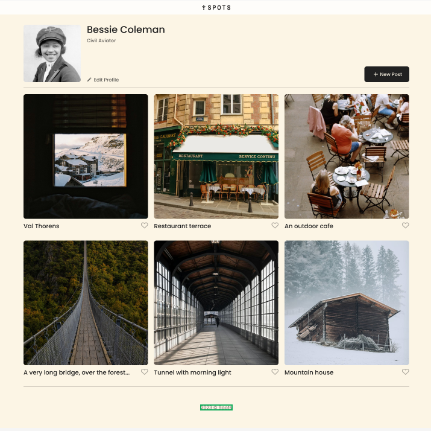
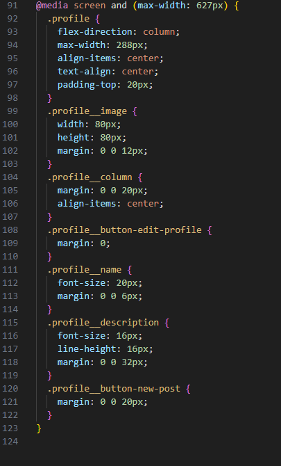

# Project 3: Spots

# Description
This project is a social media page called "Spots". The interface allows users to add images and captions for others to view. Currently the interface only allows social interaction via "liking" content posted.

# Technologies and Techniques
The project further explores the users hard coding skills with HTML and CSS. New techniques introduced include adding grid layouts, media queiries, and adapting a webpage to be responsive. JavaScript use to increase the functionality of the webpage. 

Technologies used for the project include industry-standard softwares like Figma, GitBash, and VS code to take a UI/UX design and code it into a user-friendly interface. 

# Pictures

Figma Brief:

Media Queries:

# Link to Github Pages
https://anniem101.github.io/se_project_spots/

# Link to Video
https://drive.google.com/file/d/1H8scETmQE6xfbHX22UKbIAXRO0nRXYaC/view?usp=drive_link

